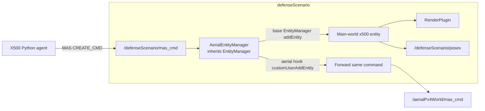
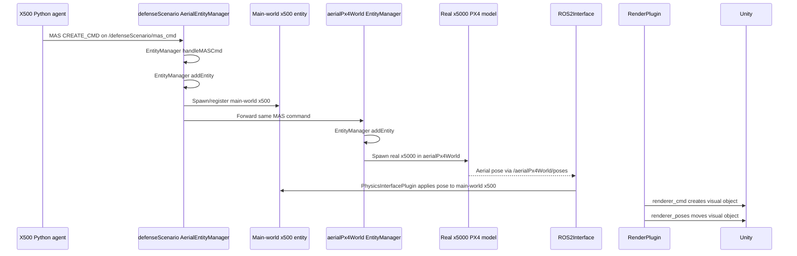

# LOTUSim PX4 Full Flow Corrected Diagram

This diagram shows the current PX4 integration flow using the separated-world LOTUSim architecture.

Important correction: there is no separate Python `x500.py` pose bridge in the current checkout. The aerial pose is mirrored into the main world by LOTUSim core:

```text
ROS2Interface + PhysicsInterfacePlugin
```

The aerial world publishes `/aerialPx4World/poses`, then the main world's physics interface subscribes to that pose stream and applies the pose to the main-world x500 entity.

## Full Flow

```mermaid
flowchart LR
    User["User launches scenario"] --> Config["Scenario JSON<br>x500 px4=true"]
    Config --> AM["AgentsManager<br>creates X500 Python ROS 2 node"]
    AM --> X500Agent["X500 Python agent node"]

    X500Agent -->|MAS CREATE_CMD| MainMAS["/defenseScenario/mas_cmd"]

    subgraph MainWorld["Gazebo main world: defenseScenario"]
        MainMAS --> AEM["AerialEntityManager<br>inherits EntityManager"]

        AEM -->|base EntityManager addEntity| MainX500["Main-world x500 entity<br>LOTUSim and Unity render object"]
        AEM -->|customUserAddEntity forwards command| AerialMASOut["forward to aerial world"]

        PhysicsPlugin["PhysicsInterfacePlugin"] -->|getNewState| ROS2Interface["ROS2Interface<br>stores latest aerial pose"]
        ROS2Interface -->|returns aerial pose| PhysicsPlugin
        PhysicsPlugin -->|SetComponentData Pose| MainX500

        MainX500 --> RenderPlugin["RenderPlugin"]
        MainX500 --> MainPosePub["EntityManager pose publishing<br>inside AerialEntityManager"]

        RenderPlugin -->|/defenseScenario/renderer_cmd| ROS2["ROS 2 graph"]
        RenderPlugin -->|/defenseScenario/renderer_poses| ROS2
        MainPosePub -->|/defenseScenario/poses| ROS2
    end

    AerialMASOut --> AerialMAS["/aerialPx4World/mas_cmd"]

    subgraph AerialWorld["Gazebo aerial world: aerialPx4World"]
        AerialMAS --> AerialEM["EntityManager"]
        AerialEM -->|addEntity cmd| RealX500["x5000<br>x500_px4 Gazebo model"]

        RealX500 --> MotorPlugins["MulticopterMotorModel plugins"]
        MotorPlugins --> Physics["Gazebo physics<br>gravity and 500 Hz"]
        Physics -->|updates model pose| RealX500

        RealX500 --> Sensors["IMU / barometer / GPS / magnetometer"]
        RealX500 --> AerialPosePub["EntityManager pose publishing"]
        AerialPosePub -->|/aerialPx4World/poses| ROS2
    end

    ROS2 -->|/aerialPx4World/poses| ROS2Interface

    X500Agent -->|launches PX4 process<br>PX4_GZ_WORLD and PX4_GZ_MODEL_NAME| PX4["PX4 SITL"]
    QGC["QGroundControl"] -->|MAVLink commands<br>arm / takeoff / manual control| PX4
    PX4 -->|MAVLink telemetry<br>state / health / position| QGC

    PX4 -->|motor_speed commands| MotorPlugins
    Sensors -->|simulated sensor data| PX4

    ROS2 --> ROSTCP["ros_tcp_endpoint"]
    ROSTCP --> Unity["Unity executable"]
    Unity --> UnityDrone["Visible x500 drone"]
```



## Main-World Detail

The main world does not load a separate normal `EntityManager` plugin. It loads `AerialEntityManager`, which inherits from `EntityManager`.

That means `AerialEntityManager` does both jobs:

- receives `/defenseScenario/mas_cmd`;
- spawns/registers the main-world x500 entity through the base `EntityManager::addEntity(cmd)`;
- forwards the same aerial command to `/aerialPx4World/mas_cmd`.



## Aerial Pose Mirroring Detail

The real PX4-controlled drone moves in `aerialPx4World`. Unity follows the main-world entity, so LOTUSim must copy the aerial pose back into the main world.

This is done through `ROS2Interface` and `PhysicsInterfacePlugin`, not through a Python bridge.

```mermaid
flowchart LR
    subgraph AerialWorld["aerialPx4World"]
        RealX500["x5000 real PX4 model"] --> AerialEM["EntityManager"]
        AerialEM -->|publishes| AerialPoses["/aerialPx4World/poses"]
    end

    AerialPoses --> ROS2Interface["ROS2Interface<br>stores latest aerial pose"]

    subgraph MainWorld["defenseScenario"]
        PhysicsPlugin["PhysicsInterfacePlugin"] -->|getNewState| ROS2Interface
        ROS2Interface -->|returns aerial pose| PhysicsPlugin
        PhysicsPlugin -->|SetComponentData Pose| MainX500["Main-world x500 entity"]
        MainX500 --> RenderPlugin["RenderPlugin"]
        RenderPlugin --> RendererPoses["/defenseScenario/renderer_poses"]
    end

    RendererPoses --> ROSTCP["ros_tcp_endpoint"]
    ROSTCP --> Unity["Unity executable"]
```



## Spawn Sequence



## Code References

Generic Scenario reads `aerial_world` from config and launches it:

```text
src/simulation_run/simulation_run/utils.py
src/simulation_run/simulation_run/simulation_runner.py
```

`X500` starts PX4 and points it to the spawned Gazebo model:

```text
src/agents/x500/x500/x500.py
```

Main-world `AerialEntityManager` receives the main MAS command and forwards aerial commands:

```text
LOTUSim/systems/aerial_demo_entity_manager/src/aerial_entity_manager.cpp
```

`EntityManager` spawns models and publishes `/<world>/poses`:

```text
LOTUSim/systems/entity_manager/src/entity_manager.cpp
```

`ROS2Interface` subscribes to aerial poses:

```text
LOTUSim/systems/physics_engine_interface/src/ros2_interface.cpp
```

`PhysicsInterfacePlugin` applies the mirrored aerial pose to the main-world x500:

```text
LOTUSim/systems/physics_engine_interface/src/physics_interface_plugin.cpp
```

`RenderPlugin` publishes Unity render create and pose messages:

```text
LOTUSim/systems/render_interface/src/render_plugin.cpp
LOTUSim/systems/render_interface/src/ros_interface.cpp
```

## Short Explanation

The real drone is the `x5000` model in `aerialPx4World`. PX4 controls it through Gazebo motor commands, and Gazebo physics updates its pose.

The aerial world's `EntityManager` publishes that pose on `/aerialPx4World/poses`. The main world's `ROS2Interface` subscribes to that pose stream and the `PhysicsInterfacePlugin` applies the pose to the main-world x500 entity. Then `RenderPlugin` reads the main-world x500 pose and publishes `/defenseScenario/renderer_poses`, which reaches Unity through `ros_tcp_endpoint`.

So the Unity path is:

```text
aerialPx4World x5000 moves
-> /aerialPx4World/poses
-> ROS2Interface
-> PhysicsInterfacePlugin updates main-world x500
-> RenderPlugin publishes /defenseScenario/renderer_poses
-> ros_tcp_endpoint
-> Unity moves visible drone
```