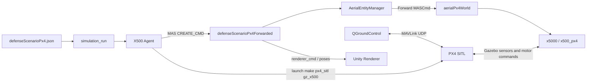

# Technical Report: PX4 Integration Into LOTUSim Generic Scenario

## 1. Purpose

This report describes how PX4 SITL was integrated into LOTUSim Generic Scenario for the X500 aerial drone workflow.

The goal of the integration is to allow an X500 drone spawned from a Generic Scenario configuration to be controlled by PX4 SITL and QGroundControl while preserving LOTUSim's existing separated-world architecture.

The final behavior is:

```text
Generic Scenario launches the simulation
X500 agent is spawned as x5000
The aerial spawn is forwarded to aerialPx4World
PX4 SITL starts and attaches to x5000
QGroundControl connects to PX4 through MAVLink
PX4 receives Gazebo sensor data
PX4 publishes motor commands back to Gazebo
The drone moves in simulation
```

## 2. Repositories Involved

The integration spans two repositories.

### LOTUSim Core

Path:

```text
$LOTUSIM_PATH
```

Responsibilities:

- Gazebo worlds
- Gazebo models
- EntityManager plugin
- AerialEntityManager forwarding plugin
- RenderPlugin and Unity-facing ROS messages
- Gazebo physics, sensor, and motor plugin support

### LOTUSim Generic Scenario

Path:

```text
$LOTUSIM_SCENARIO_WS
```

Responsibilities:

- scenario configuration
- agent creation
- X500 agent behavior
- PX4 process startup
- Unity executable startup
- scenario launch workflow

### PX4-Autopilot

Path:

```text
$HOME/PX4-Autopilot
```

Responsibilities:

- PX4 SITL flight controller
- Gazebo bridge module
- MAVLink server
- QGroundControl communication
- estimator, sensors, arming, and motor output logic

PX4 is used as an external dependency. No PX4 source code changes were required.

## 3. Why A Separate Aerial World Is Kept

LOTUSim already separates aerial agents from the main defense scenario world.

The main world, `defenseScenario`, supports surface and underwater simulation behavior. It is designed around LOTUSim's existing naval simulation stack, including XDyn-related workflows.

PX4-controlled drones need a different simulation setup:

- real gravity
- higher physics update rate
- PX4-compatible sensor topics
- multicopter motor plugins
- stable model naming
- Gazebo world/model topics that PX4 expects

For this reason, the integration keeps the intended architecture:

```text
defenseScenarioPx4Forwarded.world
  main scenario/render world

aerialPx4World.world
  real aerial physics world for PX4 drones
```

This avoids breaking existing LOTUSim surface/underwater scenarios while introducing PX4 support for aerial agents.

## 4. High-Level Architecture



## 5. Scenario Configuration

The PX4 scenario is configured in:

```text
src/simulation_run/config/defenseScenarioPx4.json
```

Relevant fields:

```json
{
  "world_file": "defenseScenarioPx4Forwarded.world",
  "aerial_world": "aerialPx4World.world",
  "agents": {
    "X500": {
      "nb_agents": 1,
      "poses": [[20.0, 100.0, 20.0, 0.0, 0.0, 0.0]],
      "sdf_file": "model.sdf",
      "xdyn": false,
      "px4": true,
      "px4_control": "manual"
    }
  },
  "aerial_domain": true,
  "renderer_unity": true
}
```

The important field is:

```json
"px4": true
```

This tells the X500 agent to use the PX4-capable Gazebo model and to start PX4 SITL after the spawn command.

## 6. Launch Flow

The user starts the scenario with:

```bash
./src/simulation_run/executable/scenario_launch.sh \
  --config src/simulation_run/config/defenseScenarioPx4.json \
  --debug
```

The launch script performs the following steps:

1. Starts ROS TCP endpoint for Unity.
2. Starts Unity executable if `renderer_unity` is true.
3. Starts the `simulation_run` ROS 2 entry point.
4. `simulation_run` launches the aerial world.
5. `simulation_run` launches the main scenario world.
6. `AgentsManager` creates and spawns the configured X500 agent.
7. The X500 agent starts PX4 SITL.

The two worlds are launched as:

```text
lotusim run aerialPx4World.world
lotusim run defenseScenarioPx4Forwarded.world
```

The aerial world is launched first so the main world can forward aerial spawn commands to it.

## 7. Agent Creation And PX4 Flag

The agent manager reads each agent block from the scenario configuration.

In:

```text
src/simulation_run/simulation_run/agents_manager.py
```

the PX4 flag is extracted:

```python
px4_enabled = bool(agent_info.get("px4", False))
```

That flag is passed into the X500 agent constructor:

```python
agent_node = self._create_agent_instance(
    agent_class,
    unique_sdf,
    world_name,
    xdyn_enabled,
    px4_enabled=px4_enabled,
)
```

The instance name is generated as:

```text
x5000
```

That name becomes the Gazebo model instance name and the PX4 attachment target.

## 8. X500 PX4 Behavior

The main PX4 integration hook is in:

```text
src/agents/x500/x500/x500.py
```

When PX4 is enabled:

```python
self.model_name = "x500_px4" if px4_enabled else "x500"
self.renderer_type_name = "x500"
```

This creates an intentional split:

```text
Gazebo/PX4 model: x500_px4
Unity visual model: x500
Spawned instance: x5000
```

This is important because Unity already knows how to render `x500`, while Gazebo/PX4 needs the enhanced `x500_px4` model with sensors and motor plugins.

After the normal LOTUSim spawn command is sent, PX4 is started:

```python
result = super().send_single_mas_cmd(value, server_timeout_sec)
...
self._start_px4_sitl()
```

PX4 is started using:

```python
cmd = ["make", "px4_sitl", "gz_x500"]
```

with this environment:

```python
env["GZ_CONFIG_PATH"] = f"/usr/share/gz:{env.get('GZ_CONFIG_PATH', '')}"
env["PX4_GZ_MODEL_NAME"] = self.agent_name
env["PX4_GZ_WORLD"] = gz_world
```

For the first drone:

```bash
PX4_GZ_MODEL_NAME=x5000
PX4_GZ_WORLD=aerialPx4World
```

This is how PX4 knows which existing Gazebo model and world to attach to.

## 9. MAS Spawn Command

All agents use the LOTUSim MAS command action interface.

In:

```text
src/simulation_run/simulation_run/agent.py
```

the action client is created for the main world:

```python
self.mas_action_client = ActionClient(
    self,
    lotusim_msgs.action.MASCmd,
    f"/{world_name}/mas_cmd"
)
```

The spawn command contains:

```python
cmd.cmd_type = MASCmd.CREATE_CMD
cmd.model_name = self.model_name
cmd.sdf_file = self.sdf_file
cmd.vessel_name = self.agent_name
cmd.sdf_string = self.lotus_param()
```

For the PX4 X500 case:

```text
cmd.model_name  = x500_px4
cmd.sdf_file    = model.sdf
cmd.vessel_name = x5000
```

This command is sent to:

```text
/defenseScenario/mas_cmd
```

## 10. Aerial Forwarding Bridge

The main world file is:

```text
assets/worlds/defenseScenarioPx4Forwarded.world
```

It contains:

```xml
<plugin filename="aerial_demo_entity_manager" name="lotusim::gazebo::AerialEntityManager">
    <aerial_namespace>aerialPx4World</aerial_namespace>
</plugin>
```

This tells the main world where aerial spawn commands should be forwarded.

The forwarding logic is in:

```text
systems/aerial_demo_entity_manager/src/aerial_entity_manager.cpp
```

It creates an action client to:

```text
/aerialPx4World/mas_cmd
```

Then forwards the original MAS command:

```cpp
aerial_goal_msg.cmd = msg;
m_aerial_entity_manager_client->async_send_goal(
    aerial_goal_msg,
    send_goal_options);
```

So the spawn path is:

```text
Generic Scenario X500 agent
  -> /defenseScenario/mas_cmd
  -> AerialEntityManager
  -> /aerialPx4World/mas_cmd
  -> x5000 created in aerialPx4World
```

## 11. PX4-Compatible Aerial World

The dedicated PX4 aerial world is:

```text
assets/worlds/aerialPx4World.world
```

Important world settings:

```xml
<world name="aerialPx4World">
  <gravity>0 0 -9.8066</gravity>

  <physics type="ode">
    <max_step_size>0.002</max_step_size>
    <real_time_update_rate>500</real_time_update_rate>
    <real_time_factor>1</real_time_factor>
  </physics>
</world>
```

These settings are needed because PX4 expects a real flight environment rather than the zero-gravity naval scenario world.

The aerial world also loads sensor and entity-management systems, including:

- IMU system
- magnetometer system
- air pressure system
- sensors system
- navsat system
- physics system
- entity manager
- scene broadcaster
- wind effects

## 12. PX4-Compatible X500 Model

The PX4 model is:

```text
assets/models/x500_px4/model.sdf
```

It contains simulated sensors required by PX4:

```xml
<sensor name="imu_sensor" type="imu">
<sensor name="air_pressure_sensor" type="air_pressure">
<sensor name="magnetometer_sensor" type="magnetometer">
<sensor name="navsat_sensor" type="navsat">
```

It also contains four Gazebo multicopter motor plugins:

```xml
<plugin filename="gz-sim-multicopter-motor-model-system"
  name="gz::sim::systems::MulticopterMotorModel">
  <commandSubTopic>command/motor_speed</commandSubTopic>
</plugin>
```

These plugins apply motor forces to the drone when PX4 publishes actuator commands.

## 13. PX4-Gazebo Communication

No custom PX4 bridge was written for this integration.

PX4 already provides the bridge in:

```text
$PX4_AUTOPILOT_PATH/src/modules/simulation/gz_bridge
```

The bridge subscribes to Gazebo topics using the world and model names passed by the integration.

For this project, PX4 subscribes to topics like:

```text
/world/aerialPx4World/clock
/world/aerialPx4World/pose/info
/world/aerialPx4World/model/x5000/link/base_link/sensor/imu_sensor/imu
/world/aerialPx4World/model/x5000/link/base_link/sensor/air_pressure_sensor/air_pressure
/world/aerialPx4World/model/x5000/link/base_link/sensor/magnetometer_sensor/magnetometer
/world/aerialPx4World/model/x5000/link/base_link/sensor/navsat_sensor/navsat
```

PX4 publishes motor commands to:

```text
/x5000/command/motor_speed
```

Gazebo also exposes this as:

```text
/model/x5000/command/motor_speed
```

PX4's bridge converts Gazebo sensor messages into PX4 internal sensor messages, then PX4's estimator and controller produce actuator outputs. Those actuator outputs are published back to Gazebo as motor speed commands.

## 14. QGroundControl Communication

QGroundControl does not communicate with LOTUSim directly.

QGroundControl connects to PX4 through MAVLink, usually over UDP on localhost.

The control path is:

```text
QGroundControl
  -> MAVLink
  -> PX4 SITL
  -> Gazebo motor command topic
  -> x5000 motor plugins
  -> drone moves
```

The feedback path is:

```text
Gazebo x5000 sensors
  -> PX4 gz_bridge
  -> PX4 estimator/state
  -> MAVLink telemetry
  -> QGroundControl
```

## 15. Why PX4 Integration Appears Small

The amount of custom integration code is small because the heavy work already exists in PX4 and Gazebo.

PX4 already provides:

- SITL
- flight controller
- estimator
- MAVLink
- Gazebo bridge
- actuator output interface

Gazebo already provides:

- physics simulation
- sensor simulation
- motor plugins
- topic transport

LOTUSim Generic Scenario mainly provides:

- spawn lifecycle
- correct world selection
- correct model selection
- PX4 process launch
- correct environment variables
- Unity rendering compatibility

The integration is therefore mostly about making names, topics, worlds, and process timing match.

## 16. What Was Changed

### Generic Scenario

Added or modified:

- PX4-enabled scenario config: `defenseScenarioPx4.json`
- X500 PX4 startup hook in `x500.py`
- support for choosing `x500_px4` as Gazebo model when `px4: true`
- Unity renderer type kept as `x500`
- PX4 environment variables:
  - `PX4_GZ_MODEL_NAME`
  - `PX4_GZ_WORLD`
  - `GZ_CONFIG_PATH`
- support for `aerial_world` namespace propagation
- README PX4 setup instructions

### LOTUSim Core

Added or modified:

- `aerialPx4World.world`
- `defenseScenarioPx4Forwarded.world`
- `x500_px4` Gazebo model
- PX4-compatible sensor and motor plugin setup

## 17. Summary

PX4 was integrated into LOTUSim by preserving the existing separate aerial-world design and adding a PX4-aware X500 workflow.

The main integration points are:

- Generic Scenario spawns an X500 agent.
- The X500 agent selects `x500_px4` as the Gazebo model when PX4 is enabled.
- The main world forwards aerial spawn commands to `aerialPx4World`.
- PX4 SITL is launched with the correct world and model environment variables.
- PX4's existing Gazebo bridge handles sensor and actuator communication.
- QGroundControl controls PX4 through MAVLink.
